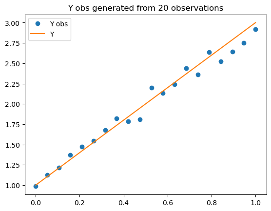
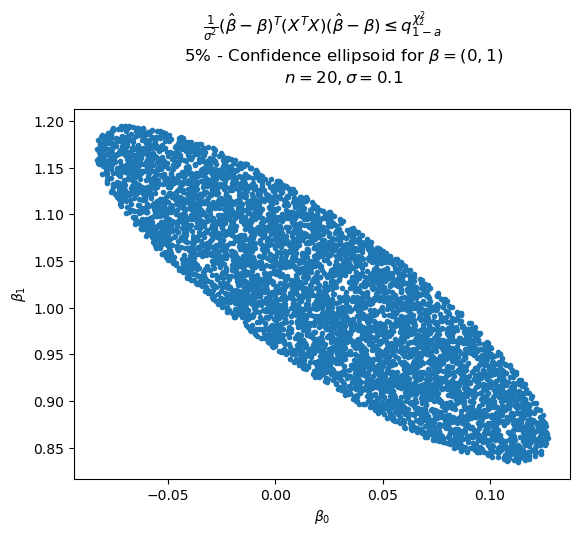
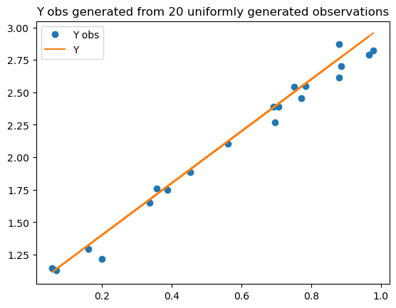

# LinReg-MAP361


Repository created to propose a solution to the assignement : "Linear Regression" from the course MAP361 (Applied Mathematics) at École Polytechnique

## Summary

* [Features](#features)
* [Technologies](#technologies)
* [Build Project](#build-project)
* [Run Project](#run-project)
* [Descriptions](#descriptions)
* [License](#license)

## Features

...

## Technologies

* Python v3.8.10
* Notebooks

## Build Project

### Virtual Enviroment

Before running the project, it is necessary to create a virtual environment in python to manage the necessary dependencies.

First install [virtualenv](https://pypi.org/project/virtualenv/) using the library in python's pip:

```shell
pip install virtualenv
```

After installation, in the root of this project, run the command:

```shell
virtualenv venv
```

In the terminal, activate the virtual environment on your machine.

**Windowns**

```shell
# In cmd.exe
venv\Scripts\activate.bat
# In PowerShell
venv\Scripts\Activate.ps1
```

**Mac/Linux**

```shell
source ./venv/bin/activate
```

### Install Dependences

With the [virtual environment](#virtual-enviroment) configured, install the dependencies using the command:

```shell
pip install -r requirements.txt
```

All dependencies are part of the file `requirements.txt`.

```txt
matplotlib==3.7.2
numpy==1.24.4
scipy==1.10.1
seaborn==0.12.2
```

## Run Project

To use the notebooks attached to this project it is possible using [google colab](https://colab.research.google.com/) or [jupyter notebook](https://jupyter.org/).

## Results







## License

For the use of the code developed in this repository, it is necessary to quote it in accordance with the terms presented in [LICENSE](./LICENSE).